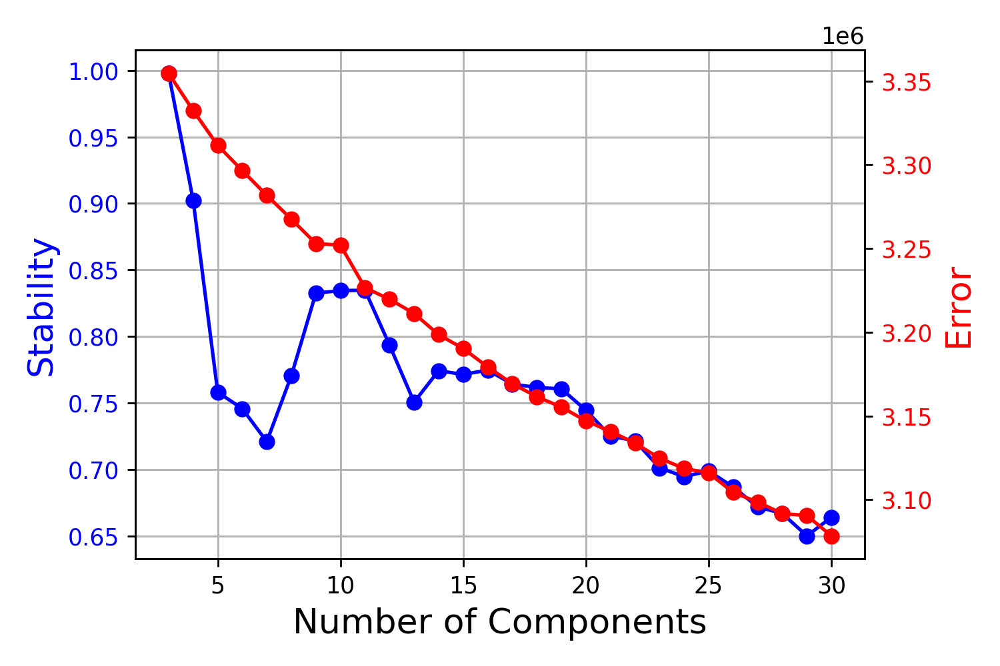

# Detection, expression scoring and differential expression analysis of gene modules

## Gene module detection
The initial detection of gene modules is done using [cNMF](https://github.com/dylkot/cNMF) ([https://doi.org/10.7554/eLife.43803](https://elifesciences.org/articles/43803)). The data used as input is a count matrix for all cells of interest written out from Seurat or Scanpy. In this analysis, I also determined highly variable genes passed to cNMF with Seurat. Results from cNMF are then further analyzed in R, e.g. to identify consensus modules from the cNMF-gene modules dreived from many samples.
### Steps:
- For each dataset of interest, write the count matrix to tsv-file and the variable genes list to txt-file. This is shown for different sets of NB cells [here](./cNMF_data_prep.ipynb).
- Count matrix and variable genes list serve as input for cNMF. Run module detection for a sensible range of ks (k = number of expected gene modules). Module detection for NB cells from a single tumor sample was carried out like [this](./cnmf_scripts/cnmf_example_singleTumor.sh) and for NB cells from a whole MULTI-seq run like [this](./cnmf_scripts/cnmf_example_singleMULTIdataset.sh). cNMF runs in an environment with the following [specs](cnmf_scripts/cnmf_env.yml).
- Assess cNMF result stability and error across ks using the output plot below and choose the best k based on this. In this example, 9 or 10 would be good choices for k: They represent a local maximum in stability and are in a reasonable range of distinct gene expression programs to be expected in tumor cells from a single tumor.

- **Consensus module generation** - is exemplified [here](./consensus_module_generation.ipynb) for modules derived from individual primary tumors:  
	- For each sample, load the gene spectra scores (z-scores of contribution of a gene to module)  resulting from cNMF for the chosen k.
	- Perform pairwise correlations between all modules, considering all positive gene scores in the given modules.
	- Select modules that have a Pearson`s R >= 0.1 with at least two other modules. These enter consensus module generation.
	- Cluster filtered modules with hdbscan and generate consensus module by selecting genes found in over 25 % of modules in a cluster.
	- Name modules and further merge modules that share the same functional annotation.
	- Remove duplicated genes based on a hierarchical module-rank approach.

## Gene module expression scoring
Code for running module expression scoring, plotting scores and calculating fractions of cells expressing a given module is shown in [this notebook](./module_scoring.ipynb). This is shown for caculating the expression of [gene modules identified in zebrafish NB](final_gene_modules_list.csv) across all zebrafish NB cells. Scoring functions are in [this script](../sc_analysis_palettes_and_helpers.r).

### AUCell scoring
AUCell scores are calculated with the [AUCell R package](https://github.com/aertslab/AUCell) to understand the relative expression of gene modules across cells.

### Binary expression test scoring
Gene module expression scores between 0 and 1 are calculated following the appraoch described in and code published with [Barkley et al., Nat Gen 2022](https://doi.org/10.1038/s41588-022-01141-9). The score is determined as the rank of the module score relative to the score for 1000 random gene sets. A score of 0.5 corresponds to the module of interest being expressed more strongly than 50 % of all random gene sets. If a module has an expression score of 0.5 or higher in a cell, it is considered expressed. This way, a module can be assigned a binarized score (expressed or not expressed) across cells, allowing the calculation of the fraction of cells in a sample that expresses the module.

### Count-sums
For determining variance of module expression later on, a basic module score is derived as the sum of counts of all module genes in a cell.
