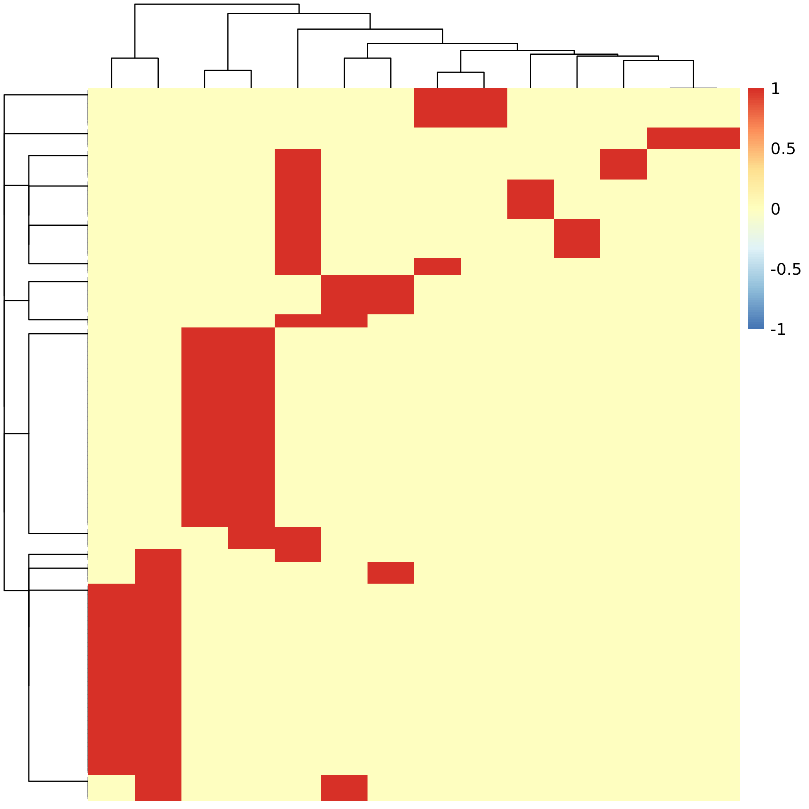
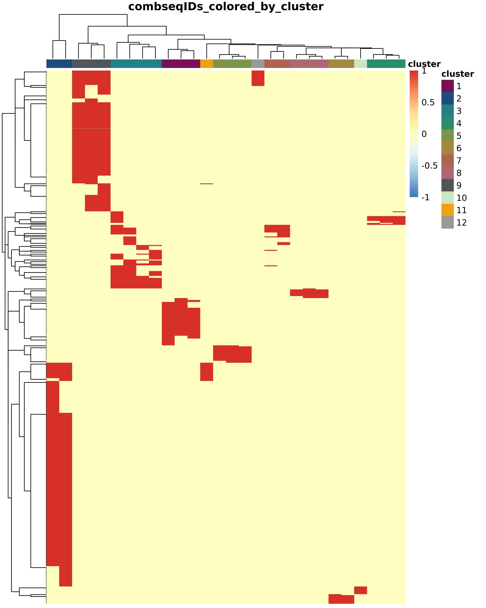
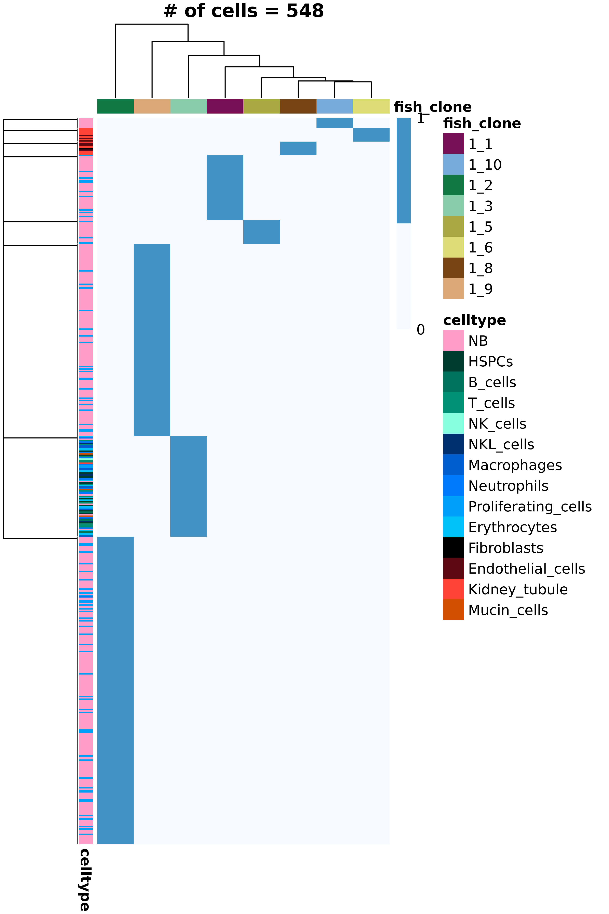
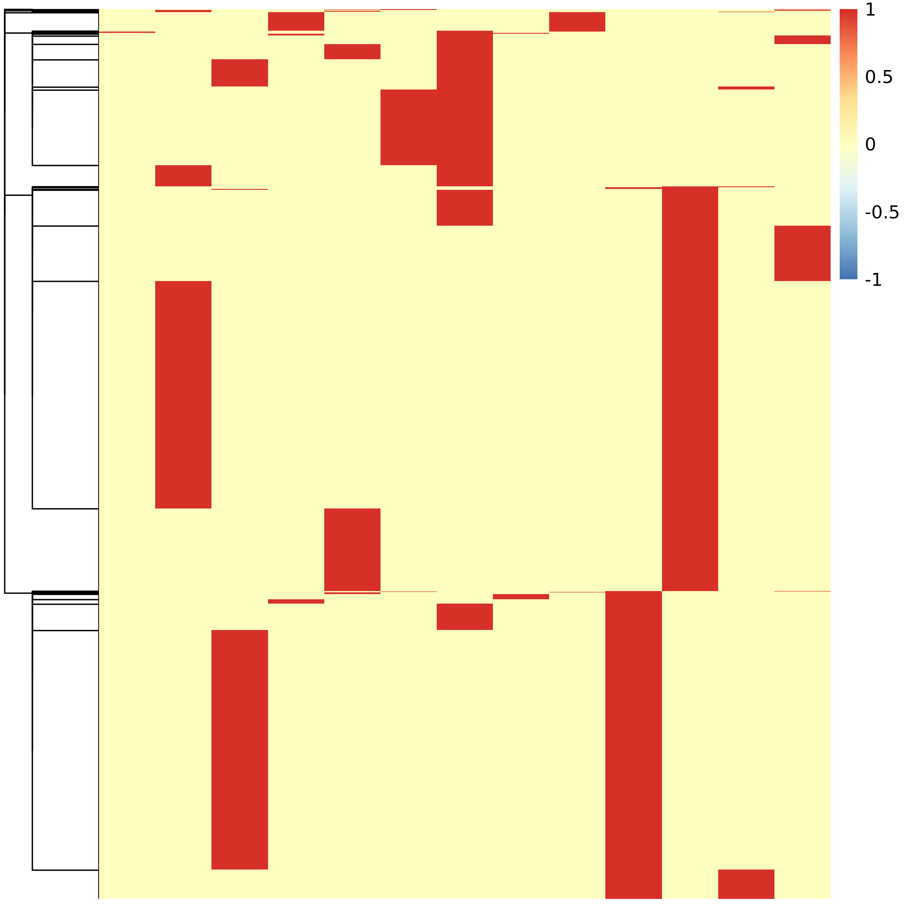

# Single cell lineage tracing
**... based on CRISPR/Cas9-induced barcodes in endogenous genes and a transgenic recording cassette**
  
## Contents of this directory
- [dir linBC_extraction](./linBC_extraction/):
    - Scripts for extracting lineage barcode sequences from fastqs obtained from 10x-cDNA-derived targeted endogenous gene libraries and a targeted transgenic gene library (set to dsRedRecCas target).
    - Config-files to pass file names and parameters to the lineage barcode extraction scripts.
    - Wildtype sequence reference fastas.
    - Commands for running the scripts.
    - Tiny example key input and output files.
    - A [README](./linBC_extraction/README_linBC_extraction.md) with more detailed information on contents.
- [dir linBC_processing_and_clone_calling](./linBC_processing_and_clone_calling/):
    - R-scripts with filtering functions for endogenous target and transgenic target sequences.
    - R-script with functions for grouping endogenous target gene lineage barcodes and cells on a per-gene basis.
    - R-script with clone calling function.
    - Lineage barcode creation probabilities for selected genes.
    - An jupyter notebook demonstrating a full workflow from filtering to clone calling
    - Small example output files.
    - A [README](./linBC_processing_and_clone_calling/README_processing_cloneCalling.md) with more detailed information on contents.
- [dir clone_recovery_in_allografts](./clone_recovery_in_allografts/):
    - A [jupyter notebook](./clone_recovery_in_allografts/linBC_processing_allografts.ipynb) demonstrating lineage barcode filtering and processing in allograft cell data, followed by assignment of allograft cells to primary tumor clones.
- [dir LINNAEUS_resources](./LINNAEUS_resources/):
    - Reproduced from [LINNAUES](https://github.com/Bastiaanspanjaard/LINNAEUS).
    - Contains key resources and background functions for lineage barcode sequence extraction and filtering for transgenic target.

## Overview of workflow
The following gives an introduction to the workflow of extracting lineage barcodes, filtering them, calling clones and finally assigning allograft cells to primary tumor clones. For further information on production and sequencing of lineage barcode libraries, please refer to the methods section of the publication.   

### 1. Lineage barcode extraction
This step takes as input sequencing read fastq-files derived from targeted libraries produced for a specific lineage tracing target gene. These libraries are derived from 10x-cDNA and are expected to be sequenced with 28 cycles on R1 and at least 90, but preferably more cycles (e.g. 150 for transgene cassette) on R2.   
The extraction workflow is performed separately for the transgenic target gene and the endogenous target genes.  
Requires bwa and samtools.  
  
#### Endogenous target lineage barcode extraction
- Fastqs for all endogenous target genes need to be merged into one fastq-file. A small example R2 can be found [here](./linBC_extraction/data/bAllos4_tums_S1_endoTargets_R2.fastq).
- The pipeline further needs a list of names of the genes to be considered, a list of valid cell barcodes written out from Seurat or Scanpy object, a reference fasta for all genes to be considered. Furthermore, a bam-file produced during mapping of the corresponding whole transcriptome library with cellranger count (possorted_genome_bam.bam) is needed.
- Location and name of input file names need to be configured in the config_endo.sh file.
- Lineage barcode extraction can then be run via the command in [commands_lineage_barcode_extraction.sh](./linBC_extraction/commands_lineage_barcode_extraction.sh) and entails the following steps:
    - Indexing of reference fasta with bwa.
    - Extraction of valid cell barcodes and UMIs for each gene of interest from the whole transcriptome mapping bam-file. This is cross-referenced with the provided list of valid cell barcodes after filtering the whole transcriptome data (e.g. in Seurat).
    - Sequencing reads from targeted libraries are mapped to the reference-fasta with bwa.
    - Mapping results are cross-referenced with the allowed cell barcode and UMI list.
    - Reads are counted for each UMI and lineage barcode.
    - Final output used downstream is in file XX_scars_UMIw_read_counts.txt ([small example](./linBC_extraction/output/bAllos4_tums_S1_endoTargets_scars_UMIw_read_counts.txt)) with one entry per combination of cell barcode, UMI and lineage target sequence. For each entry, the number of reads, the gene the sequence was derived from and the sequence-CIGAR derived from bwa-mapping are provided.  

#### Transgenic target lineage barcode extraction (here for dsRedRecCas)
- A small example R2 fastq derived from the transgenic target site can be found [here](./linBC_extraction/data/bAllos4_tums_S1_dsRedRecCas_R2.fastq).
- The pipeline further needs as input a reference fasta file, further scripts provided [here](./LINNAEUS_resources/scar_extraction) and a config file.
- Location and name of input file names need to be configured in the config_transgene.sh. Further input required here:
    - a barcode read threshold (dependent on sequencing depth; for a library derived from 10k cells and sequenced with 15 Mio reads, a typical threshold is 500 reads)
    - the sequence of the target-specific primer used for library generation to extract reads with a valid primer sequence
    - the desired length of the output lineage barcode sequence; depends on the length of R2, but should ideally cover the entire recording cassette and is therefore set to 140
- Lineage barcode extraction can then be run via the command in [commands_lineage_barcode_extraction.sh](./linBC_extraction/commands_lineage_barcode_extraction.sh) and entails the following steps:
    - Indexing of reference fasta with bwa.
    - Count reads per cell barcode and only keep cell barcodes above the threshold.
    - Map lineage sequencing reads to reference fasta with bwa, taking into account desired read clipping length and primer sequence.
    - Reads are counted for each UMI and lineage barcode and those with only one read are removed.
    - Lineage barcodes are filtered for sequencing errors using the scar_filter.py from LINNAEUS.
    - Returns two output files used downstream with small examples provided:
        - file XX_reads_over1.txt ([small example](./linBC_extraction/output/bAllos4_tums_S1_dsRedRecCas_reads_over1.txt)) with one entry per combination of cell barcode, UMI and lineage target sequence. For each entry, the number of reads and the sequence-CIGAR derived from bwa-mapping are provided.
        - file XX_filtered_scars.csv ([small example](./linBC_extraction/output/bAllos4_tums_S1_dsRedRecCas_filtered_scars.csv)) contains the sequencing-error-filtered output with one entry per combination of cell barcode, UMI and lineage target sequence. For each entry, the number of reads and the sequence-CIGAR derived from bwa-mapping are provided.

### 2. Lineage barcode filtering and processing
The files provided by the scar extraction workflow serve as input for further filtering before clone calling. All of these steps are done out in R and a full example workflow is demonstrated [here](./linBC_processing_and_clone_calling/full_clone_calling_multi_bAllos4_tums.ipynb).  
  
Further filtering is carried out separately for endogenous target genes and the transgenic target.  
  
#### Endogenous target filtering and per-gene grouping 
- Lineage barcode sequences are filtered to remove PCR and sequencing errors as well as doublet-derived sequences. Filtering thresholds are based on the assumption that one endogenous gene in one cell can have at most two distinct alleles. Therefore, only cells, in which one or two sequences make up 80 % or more of the gene-specific transcripts (UMIs) are kept and only those top sequences are kept. This threshold can be adjusted for each gene via the 'fraction' variable, but 0.8 (80 %) is recommended as a default.
- For selected genes, lineage barcode sequences are then cross-referenced with a list of barcode creation probabilities to remove barcodes that are created very frequently.
- Cells and barcodes are then grouped on a per-gene basis:
    - Sequences are shortened to 30 bp sequence IDs around the Cas9-target site.
    - Cells with two distinct sequence IDs on a gene are selected and consistently obsereved sequence ID pairs are determined. Cells with both alleles corresponding of a given pair as well as cells that can unambiguously be assigned to a pair based on only one allele are grouped.
    - These steps already group cells based on lineage relationship and can be used to assess lineage relationsships.  
**An example of clustered cells (rows) and sequence IDs for gene rpl39. Each cell carries two alleles (red heatmap color).**  

#### dsRedRecCas (transgene) target filtering and pre-processing
- Filtering relies on functions previously established for the RFP-transgene in LINNAEUS. For each combination of cell barcode and UMI, only the lineage barcode with the highest number of reads is kept. Sequences derived from PCR or sequencing errors are removed by comparing sequences within a cell to each other and removing those with a relatively low read number and low Hamming distance to others.
- A manual read-filter is applied based on UMI-read distributions to exclude sequences with few reads.
- Sequences are then split by transgene integration ID, as these represent separately edited entities within a cell.
- Based on the assumption that a single transgene integration within one cell can only carry one allele, only a sequence that makes up at least 60 % of the transcripts (UMIs) in a cell is kept.

### 3. Clone calling based on all target genes
- The function with detailed information on steps and inputs can be found [here](./linBC_processing_and_clone_calling/clone_def_all_targets.R). A brief overview is given in the following.
- Information from all target genes is merged. Each endogenous target is represented as pairs of sequence IDs determined above. Each transgene integration is considered as an individual gene. Each contributing sequence ID pair or transgene sequence is hereafter called seq-ID.
- Initally seq-IDs are clustered based on Jaccard overlap of cell barcode sets.  
**Jaccard index in cell barcode sets for all seq-IDs input into clone calling for one sample.**  
  
**An example of clustered cells (rows) and seq-IDs with seq-IDs labelled according to their initial cluster membership.**  
. 
- Clusters are further merged based on cell barcode overlap.
- Ambiguous clusters overlapping with multiple others may be removed.
- If the 'allow_large_parent_IDs' option is set to prioritize cell retention over clone calling 'resolution', larger, but less resolved clonal groups are recovered.
- Remaining ambiguous clusters and cells are removed and final clusters are used as clone-IDs.  
**Final heatmap of clustered cells (rows) and clone-IDs (columns) with cells labelled according to their assigned cell type.**  
  

### 4. Assignment of lineage barcoded graf cells to primary tumor cells of origin
- Lineage barcode data for graft cells is extracted and filtered in the same way as described above.
- Endogenous target sequences are shortened to 30 bp sequence IDs around the Cas9-target site. Then, cells with two distinct sequence IDs on a gene are selected and sequence ID pairs are determined. Sequence ID pairs are not filtered further, but later used for cross-referencing with the primary tumor clone-assigned sequence ID pairs. Example output for rpl39 is shown [here](./clone_recovery_in_allografts/output/all_target_combSeqIDpairs_multi_seq_19_tum_all.csv).    
**An example of clustered cells (rows) and sequence IDs for gene rpl39. Each cell carries two alleles (red heatmap color).**  
  
- The transgenic lineage barcode data is processed in the same way as described above before clone calling.
- Seq-IDs from all target genes are merged and saved in [all_target_combSeqIDpairs_XX.csv](./clone_recovery_in_allografts/output/all_target_combSeqIDpairs_multi_seq_19_tum_all.csv). For each cell, any combination of seq-IDs observed in it is generated. E.g. if a cell contains seq-IDs A, B and C, none of them may be definitive of a primary tumour clone. However, the combination of A and B or A, B and C might be.
- The function used to call clones in primary tumor cells ('clone_def') prepares the combination of seq-IDs in primary tumors with assignment which combinations are found in which clone. This file is loaded and information on which seq-ID combinations are definitive of a fish or tumour of origin is added. A small example result is shown [here](./clone_recovery_in_allografts/output/onlyPTFishDefining_seqIDcombinations_from_individual_tums_PTs_50exampleCells.csv). This is used to cross-reference with the graft cells.
- Graft cells are then assigned to a primary tumor clone, if they carry a seq-ID combination definitive of that clone. A small example set of allograft cells with assigned primary tumor clones is shown [here](./clone_recovery_in_allografts/output/unfiltered_comb_seq_ids_with_PT_assignment_lateAllos_50exampleCells.csv).
